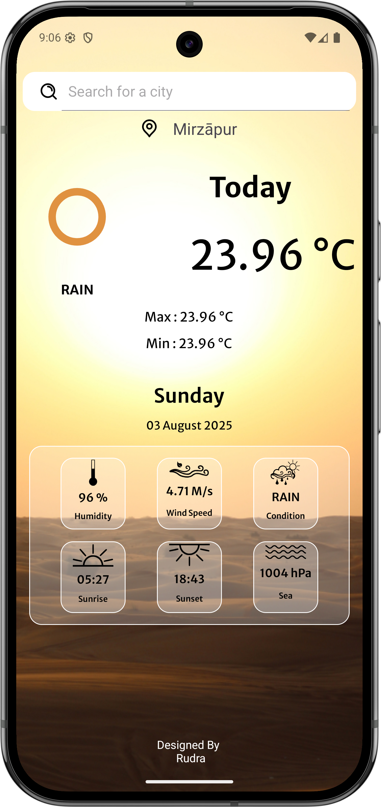

# 🌦️ Weather App

A sleek and minimalistic **Weather App** built using **Kotlin** and **Retrofit** for Android. It fetches real-time weather data from **OpenWeatherMap API** and displays current temperature, condition, humidity, wind speed, sunrise, sunset, and more with Lottie animations and dynamic backgrounds.

---

## 📸 Screenshots



---

## 🚀 Features

- 🌐 Real-time weather data using OpenWeatherMap API  
- 🔍 Search any city using SearchView  
- 🎨 Dynamic background changes based on weather condition  
- 📊 Shows:
  - Temperature
  - Humidity
  - Wind Speed
  - Sea Level Pressure
  - Sunrise & Sunset
  - Weather condition  
- 🗓️ Displays current date and day  
- ✨ Animated icons with Lottie  

---

## 🛠️ Tech Stack

| Technology | Usage |
|------------|--------|
| Kotlin | Android app development |
| Retrofit | HTTP client for API |
| Gson | JSON parsing |
| ViewBinding | Efficient view access |
| Lottie | Weather animations |
| OpenWeatherMap | Data source |

---

## 🔗 API Reference

- **OpenWeatherMap API**
  - Base URL: `https://api.openweathermap.org/data/2.5/`
  - [Get your free API key here](https://openweathermap.org/api)

---

## 🔧 Setup Instructions

1. **Clone the repository**
   ```bash
   git clone https://github.com/rudresh05/weather-app.git
